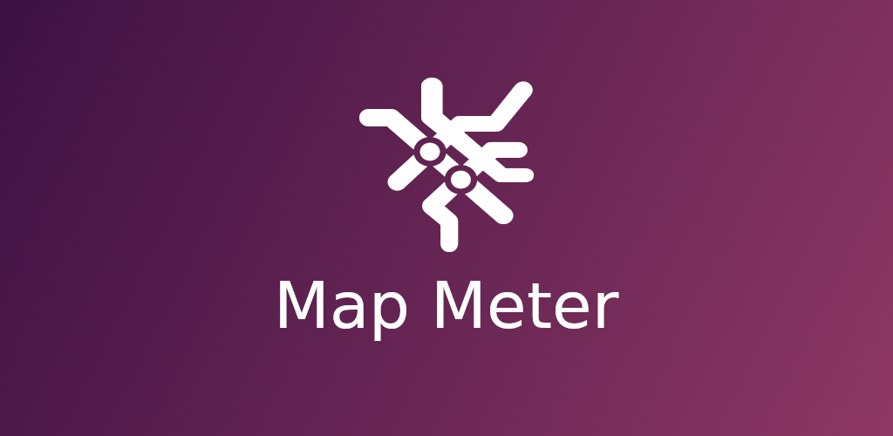
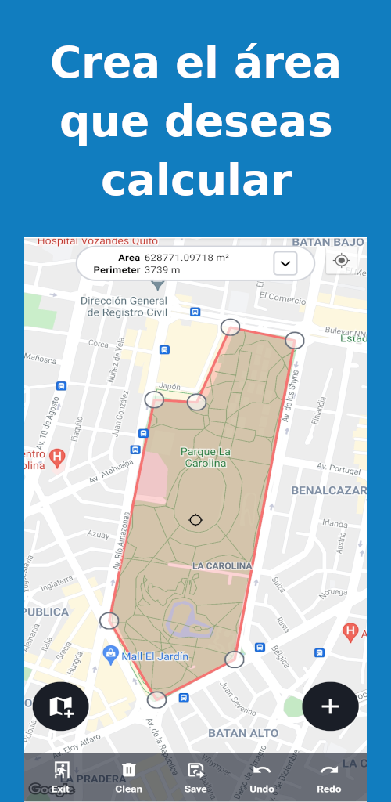
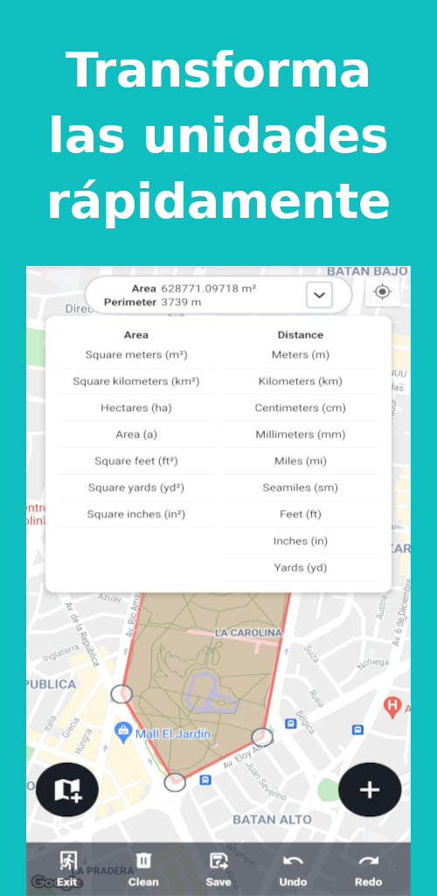
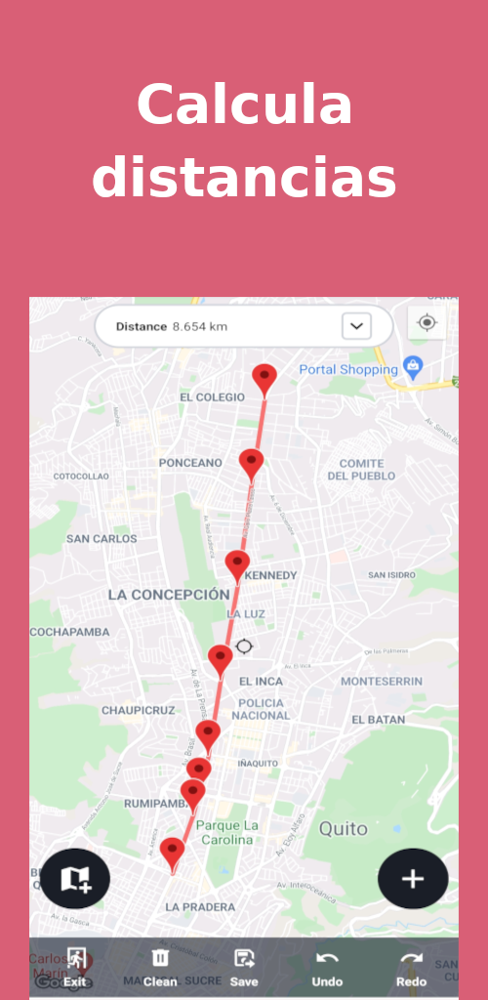
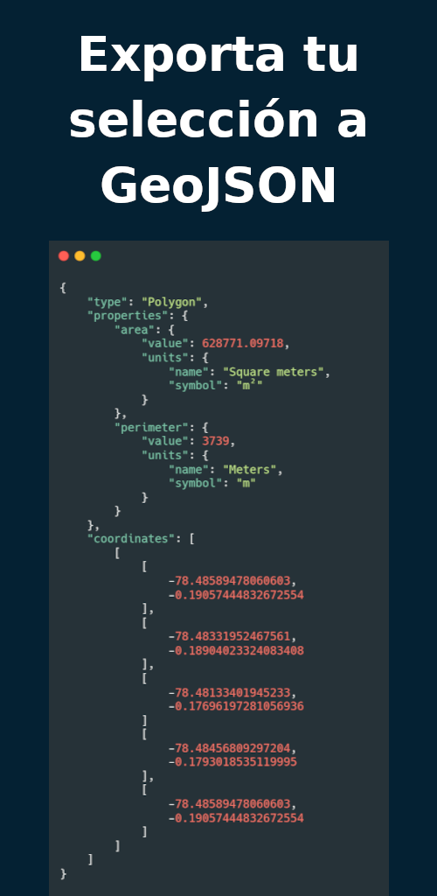

# Map Meter

## About

Create polygons, lines and get their areas, perimeters and distances.

An application in React Native, to measure distances, perimeters and polygon areas and lines in google maps, you can also export them in a GeoJSON format compatible with various applications and systems.

## Features

- Draw polygons
- Draw lines
- Calculate areas
- Calculate perimeter
- Calculate distances
- Convert units
- Export to GeoJSON
- Theme: Light - Dark

## Screenshots

### Figure 1

### Figure 2

### Figure 3

### Figure 4

